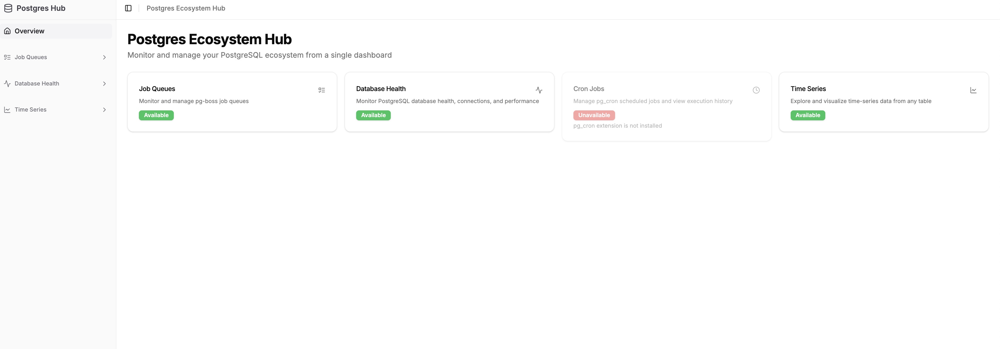
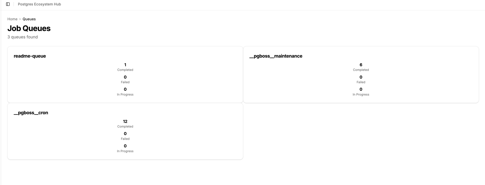
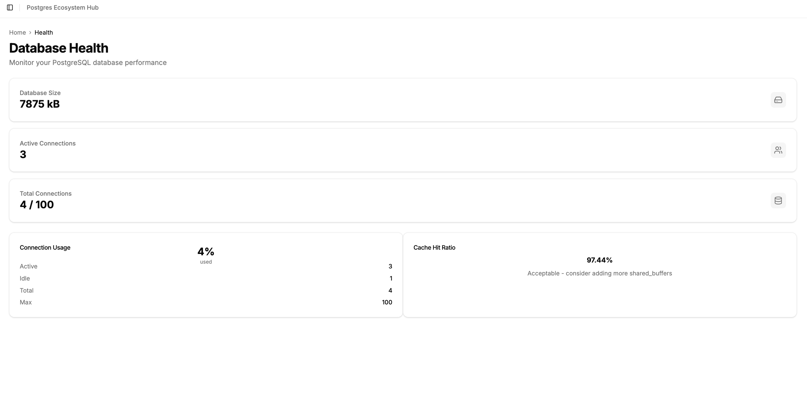
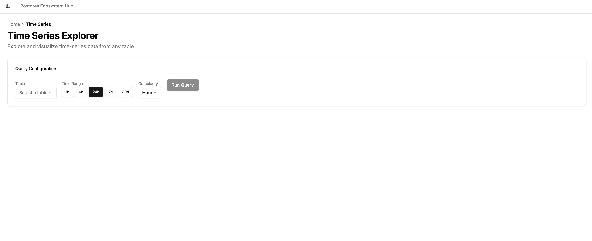

# pg-boss-dashboard

Postgres Ecosystem Hub - a unified dashboard for monitoring and managing PostgreSQL features including pg-boss job queues, database health, pg_cron scheduled jobs, and time-series data exploration.

## Features

### Job Queues (pg-boss)
- View all queues with real-time stats (completed, failed, active)
- Browse paginated job lists per queue
- View detailed job information (data, retry config, timeline, errors)
- Delete individual jobs or bulk-delete non-active jobs

### Database Health
- Connection usage gauge with active/idle/max breakdown
- Cache hit ratio monitoring
- Database size overview
- Slow query detection (configurable threshold)
- Table sizes with bar chart visualization
- Index usage statistics and unused index detection

### Cron Jobs (pg_cron)
- View all scheduled jobs with cron expression tooltips
- Toggle jobs active/inactive
- Success/failure count tracking
- Paginated execution history
- Auto-detected: hidden when pg_cron extension is not installed

### Time Series Explorer
- Auto-discover tables with timestamp columns
- Configurable time range (1h, 6h, 24h, 7d, 30d)
- Adjustable granularity (minute, hour, day, week, month)
- Interactive area chart visualization
- Raw data table view
- SQL injection prevention via information_schema validation

## Screenshots

### Hub Overview


_Dashboard showing all modules with their availability status_

### Job Queues


_Queue list with real-time completed, failed, and in-progress counts_

### Database Health


_Connection usage, cache hit ratio, and database size monitoring_

### Time Series Explorer


_Interactive time-series data exploration with configurable range and granularity_

## Usage

### Run with Docker Compose (recommended)

Starts PostgreSQL and the dashboard together:

```bash
docker compose up
```

The dashboard will be available at `http://localhost:3000` and the API at `http://localhost:3001`.

### Run with Docker (bring your own PostgreSQL)

```bash
npm run docker:build
npm run docker:run
```

Pass database connection details as environment variables:

```bash
docker run -p 3000:3000 -p 3001:3001 \
  -e DB_HOST=host.docker.internal \
  -e DB_PORT=5432 \
  -e DB_USER=postgres \
  -e DB_PASSWORD=postgres \
  -e DB_DATABASE=pg-boss-example \
  pg-boss-dashboard
```

### Run locally

Requires a running PostgreSQL instance. Configure connection in `package/api/.env`:

```bash
PORT=3001
DB_HOST=localhost
DB_PORT=5432
DB_USER=postgres
DB_PASSWORD=postgres
DB_DATABASE=pg-boss-example
```

Then start both servers:

```bash
npm run start:dev:server   # API on :3001
npm run start:dev:ui       # UI on :3000
```

## Architecture

The dashboard uses a convention-based module system:

```
package/
  api/src/modules/          # Backend modules
    queues/                 # pg-boss job queue management
    db-health/              # PostgreSQL health monitoring
    cron-jobs/              # pg_cron schedule management
    timeseries/             # Time-series data exploration
  ui/modules/               # Frontend modules
    queues/                 # Queue UI pages & components
    db-health/              # Health UI pages & components
    cron-jobs/              # Cron UI pages & components
    timeseries/             # Time series UI pages & components
```

Each module follows the same convention:
- **Backend**: `index.ts` (manifest), `routes.ts`, `controller.ts`, `service.ts`, `types.ts`
- **Frontend**: `index.ts` (UI manifest), `pages/`, `components/`, `lib/api.ts`

Modules are auto-discovered at startup. Each module can define a `healthCheck()` to conditionally enable itself (e.g., pg_cron checks for the extension).

### API

All module APIs are mounted under `/api/modules/<prefix>`:

| Module | Prefix | Key Endpoints |
|--------|--------|---------------|
| Queues | `/api/modules/queues` | `GET /queues`, `GET /queues/:name/jobs`, `GET /jobs/:id` |
| Health | `/api/modules/health` | `GET /overview`, `GET /connections`, `GET /slow-queries`, `GET /tables` |
| Cron | `/api/modules/cron` | `GET /schedules`, `PATCH /schedules/:id`, `GET /history` |
| Time Series | `/api/modules/timeseries` | `GET /tables`, `POST /query` |

Module discovery: `GET /api/modules` returns all modules with availability status.

## Environment Variables

| Variable | Default | Description |
|----------|---------|-------------|
| `PORT` | `3001` | API server port |
| `DB_HOST` | `localhost` | PostgreSQL host |
| `DB_PORT` | `5432` | PostgreSQL port |
| `DB_USER` | `postgres` | PostgreSQL user |
| `DB_PASSWORD` | `postgres` | PostgreSQL password |
| `DB_DATABASE` | `pg-boss` | PostgreSQL database name |
| `DB_CONNECTION_TIMEOUT` | `5000` | Connection timeout (ms) |
| `CORS_ORIGIN` | `http://localhost:3000` | Allowed CORS origin |
| `NEXT_PUBLIC_API_URL` | `http://localhost:3001` | API URL for the frontend |

## Tech Stack

- **Backend**: Node.js, Express, PostgreSQL (pg), Zod, TypeScript
- **Frontend**: Next.js 15, React 19, Tailwind CSS, shadcn/ui, Recharts, Lucide Icons
- **Infrastructure**: Docker, PM2, Docker Compose
